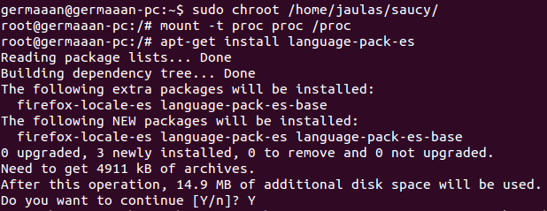

# Ejercicios 4:
### Instalar alguna sistema debianita y configurarlo para su uso. Trabajando desde terminal, probar a ejecutar alguna aplicación o instalar las herramientas necesarias para compilar una y ejecutarla.

Vamos a usar el sistema Ubuntu que instalamos en el ejercicio anterior, para entrar en la jaula que creamos usaremos `sudo chroot /home/jaulas/saucy/`. Para que funcione completamente, deberemos montar el filesystem virtual `/proc` con la orden `mount -t proc proc /proc`, y además, instalar el paquete `language-pack-es` para evitar posibles problemas con algunos comandos (`apt-get install language-pack-es`).

Podemos comprobar que ya tenemos un sistema funcional ejecutando por ejemplo el comando `top`:

También podemos desarrollar aplicaciones dentro de nuestro sistema, para ello vamos a necesitar las herramientas necesarias para compilar en el lenguaje elegido, Python en nuestro caso, así que instalamos `apt-get install python`:

Crearemos un "Hola mundo" básico (`#!/usr/bin/python print "Hola mundo!"`) y lo ejecutaremos mediante `python hola_mundo.py`:

