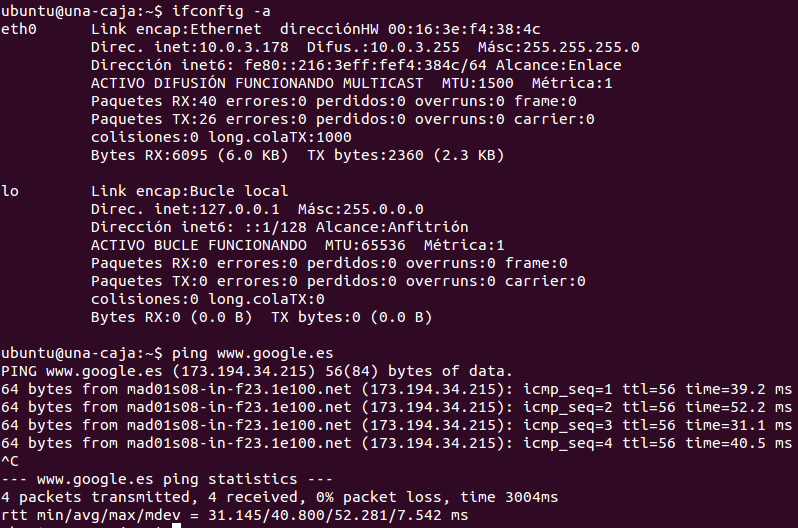
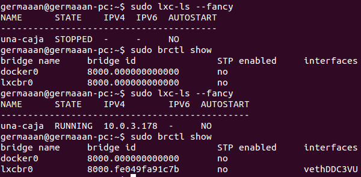

# Ejercicios 2:
### Comprobar qué interfaces puente ha creado y explicarlos

El contenedor aunque no tiene acceso al anfitrión, si podrá acceder a internet a través de él. Esto lo podemos comprobar fácilmente, ya que si dentro del contenedor introducimos `ifconfig -a`, vemos que este tiene un interfaz de red con su propia dirección IP configurada, además que si hacemos un ping de prueba, como podría ser `ping www.google.es` obtenemos respuesta.

Para que esto sea posible es necesario que se haya creado una interfaz puente entre el contenedor y el anfitrión, como el puente solo estará activo cuando el contenedor este ejecutándose, para saber que interfaz ha creado comprobamos (con el contenedor parado) los puentes de red existentes en nuestro sistema (`sudo brctl show`); veremos que hay dos puentes de red existentes, pero que no están asignados a ninguna interfaz, así que iniciamos nuestro contenedor y volvemos a comprobar los puentes de red; pudiendo observar ahora que el puente de red con nombre **"lxcbr0"** ahora tiene un identificador nuevo y además está asignado a una interfaz (**"vethDDC3VU"**).

Es fácil intuir que el nombre del puente nos hubiera ayudado a identificador dicho puente desde un primer momento (**"lxc"** y **"br0"**), pero la confirmación definitiva ha sido que haya adquirido un identificador no genérico (ya que en un principio compartía el mismo identificador con el otro puente existente y desactivado) y ser asignado a una interfaz (lo que significa que está en funcionamiento).
