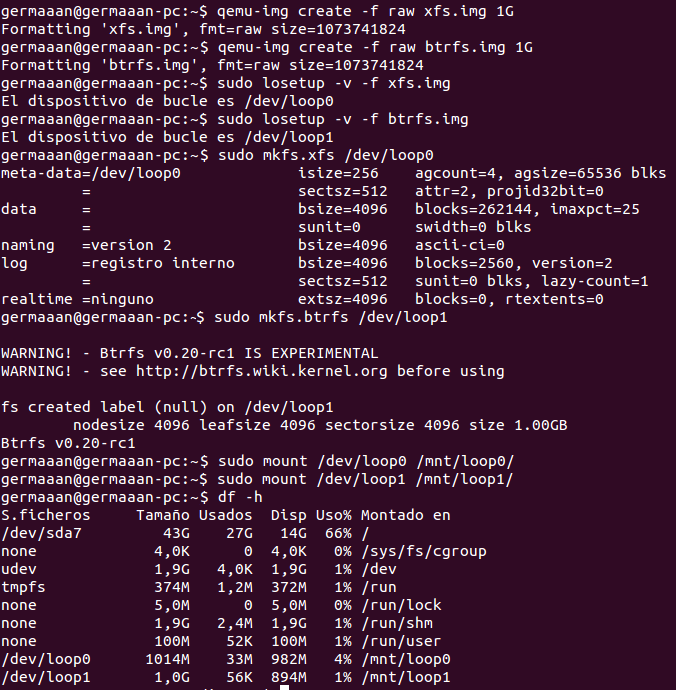

# Ejercicios 4:
### Crear uno o varios sistema de ficheros en bucle usando un formato que no sea habitual (xfs o btrfs) y comparar las prestaciones de entrada/salida entre sí y entre ellos y el sistema de ficheros en el que se encuentra, para comprobar el overhead que se añade mediante este sistema

Para crear los sistemas de ficheros en bucle, primero generamos los archivos de imagen (1), los convertimos en dipositivos de bucle (2), les damos el formato correspondiente a cada uno (3), los montamos (4) y comprobamos que aparecen como dispositivos montados en el sistema (5):

```
qemu-img create -f raw xfs.img 1G
qemu-img create -f raw btrfs.img 1G

sudo losetup -v -f xfs.img
sudo losetup -v -f btrfs.img

sudo mkfs.xfs /dev/loop0
sudo mkfs.btrfs /dev/loop1

sudo mount /dev/loop0 /mnt/loop0/
sudo mount /dev/loop1 /mnt/loop1/

df -h
```



Para comparar las prestaciones de entrada/salida, creamos 1 archivos de 200 MB con el comando `dd` usando el archivo `/dev/urandom`, ahora creamos otras dos copias de dicho archivo y las copiamos a las respectivas carpetas de cada uno de los sistemas en bucle:

```
dd if=/dev/urandom of=arch_sist bs=191 count=1048576
cp arch_sist /mnt/loop0/arch_xfs
cp arch_sist /mnt/loop1/arch_btrfs

```


Ahora para cada uno de los casos, copiaremos el archivo 3 veces: una copia a la propia unidad y otra copia a cada una de las unidades restantes. Para no tener que hacerlo manualmente, automatizaremos esta acción mediante el uso del siguiente script, que además nos permitirá obtener los tiempos y la velocidad de transferencia:

```
#!/bin/bash

TIMEFORMAT='%2R'

if [ $# -lt 3 ]; then
	echo -e "\nError: número de argumentos inválido. Uso: $0 archivoSistema archivoBucle0 archivoBucle1\n"
	exit 1
fi

echo $1
echo $1_2
echo $2
echo $2_2
echo $3
echo $3_2

time1+=$( { time `cp $1 $1_2`; } 2>&1 )
vel1=$( bc <<<"scale=2; 200/$time1" )
time2+=$( { time `cp $1 $2_2`; } 2>&1 )
vel2=$( bc <<<"scale=2; 200/$time2" )
time3+=$( { time `cp $1 $3_2`; } 2>&1 )
vel3=$( bc <<<"scale=2; 200/$time3" )

time4+=$( { time `cp $2 $2_2`; } 2>&1 )
vel4=$( bc <<<"scale=2; 200/$time4" )
time5+=$( { time `cp $2 $1_2`; } 2>&1 )
vel5=$( bc <<<"scale=2; 200/$time5" )
time6+=$( { time `cp $2 $3_2`; } 2>&1 )
vel6=$( bc <<<"scale=2; 200/$time6" )

time7+=$( { time `cp $3 $3_2`; } 2>&1 )
vel7=$( bc <<<"scale=2; 200/$time7" )
time8+=$( { time `cp $3 $1_2`; } 2>&1 )
vel8=$( bc <<<"scale=2; 200/$time8" )
time9+=$( { time `cp $3 $2_2`; } 2>&1 )
vel9=$( bc <<<"scale=2; 200/$time9" )

echo -e "\nResultados operaciones entrada/salida:"
echo -e "======================================\n"

echo -e "Copiar de sistema propio (ext4) a si mismo: $time1 segundos, $vel1 MB/s"
echo -e "Copiar de sistema propio (ext4) a sistema bucle 0 (xfs): $time2 segundos, $vel2 MB/s"
echo -e "Copiar de sistema propio (ext4) a sistema bucle 1 (btrfs): $time3 segundos, $vel3 MB/s\n"

echo -e "Copiar de sistema bucle 0 (xfs) a si mismo: $time4 segundos, $vel4 MB/s"
echo -e "Copiar de sistema bucle 0 (xfs) a sistema propio (ext4): $time5 segundos, $vel5 MB/s"
echo -e "Copiar de sistema bucle 0 (xfs) a sistema bucle 1 (btrfs): $time6 segundos, $vel6 MB/s\n"

echo -e "Copiar de sistema bucle 1 (btrfs) a si mismo: $time7 segundos, $vel7 MB/s"
echo -e "Copiar de sistema bucle 1 (btrfs) a sistema propio (ext4): $time8 segundos, $vel8 MB/s"
echo -e "Copiar de sistema bucle 1 (btrfs) a sistema bucle 0 (xfs): $time9 segundos, $vel9 MB/s"

echo -e "\n"
```


Viendo los resultados vemos que salvo un aparente cuelgue, copiar archivos desde el sistema propio a los sistemas bucle es muy rápido. A la hora de copiar en los sistemas bucles, es más rápido copiar archivos entre ellos que copiarlos al sistema principal, copiar un archivo de un sistema bucle a si mismo es la operación que más tarda en realizarse.
