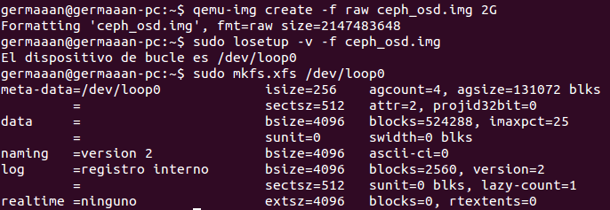
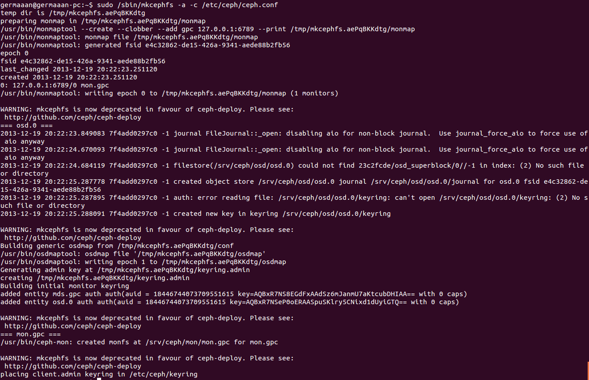
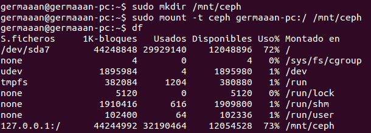

# Ejercicios 6:
### Crear un dispositivo ceph usando BTRFS o XFS

Ya que tenemos Ceph instalado, ahora toca configurarlo. Lo primero que haremos será crear los directorios donde se va a almacenar la información de Ceph:

```
sudo mkdir -p /srv/ceph/{osd,mon,mds}
```

Seguidamente creamos el archivo de configuración **/etc/ceph/ceph.conf**, configurando el monitor de objetos (**mon**), el servidor de metadatos (**mds**) y el dispositivo servidor de objetos (**osd**). Por defecto el modo de autencación Cephx viene activado por defecto, y si no lo configuramos y creamos un keyring como indican en su [página](http://ceph.com/docs/master/rados/operations/authentication/) tendremos problemas cuando vayamos a montar Ceph al final del proceso, como no he conseguido configurar Cephx, he optado por desactivarlo para no tener problemas (las 4 primeras líneas de la sección **[global]** que comienzan con la palabra **auth**). Por lo que la configuración utilizada es la siguiente:

```
[global]
	auth cluster required = none
	auth service required = none
	auth client required = none
	auth supported = none
	log file = /var/log/ceph/$name.log
	pid file = /var/run/ceph/$name.pid
[mon]
	mon data = /srv/ceph/mon/$name
[mon.gpc]
	host = germaaan-pc
	mon addr = 127.0.0.1:6789
[mds]
[mds.gpc]
	host = germaaan-pc
[osd]
	osd data = /srv/ceph/osd/$name
	osd journal = /srv/ceph/osd/$name/journal
	osd journal size = 1000
[osd.0]
	host = germaaan-pc
	xfs devs = /dev/loop0
```


Necesitamos crear un sistema bucle con formato con sistema **xfs** para que haga la función de dispositivo servidor de objetos (el que hemos indicado en el archivo de configuración como **/dev/loop0**/):

```
qemu-img create -f raw ceph_osd.img 2G
sudo losetup -v -f ceph_osd.img
sudo mkfs.xfs /dev/loop0
```



Tenemos que crear un directorio necesario para el servidor de objetos:

```
sudo mkdir /srv/ceph/osd/osd.0
```

Creamos el sistema de ficheros de objetos:

```
sudo /sbin/mkcephfs -a -c /etc/ceph/ceph.conf
```



Iniciamos el servicio:

```
sudo /etc/init.d/ceph -a start
```


Comprobamos si se ha iniciado correctamente comprobando el estado del Ceph:

```
sudo ceph -s 
```


Y finalmente creamos el directorio donde lo vamos a montar, lo montamos y comprobamos que se ha montado:

```
sudo mkdir /mnt/ceph
sudo mount -t ceph germaaan-pc:/ /mnt/ceph
df
```


