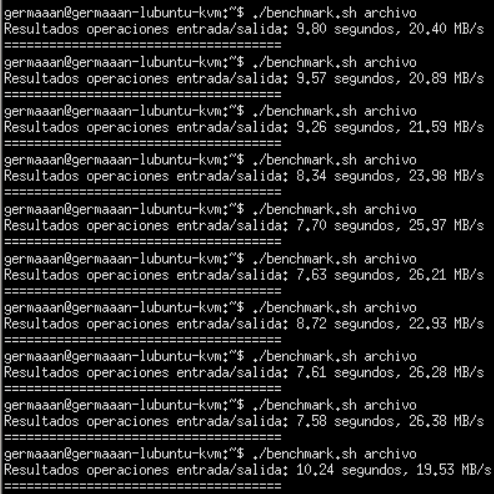
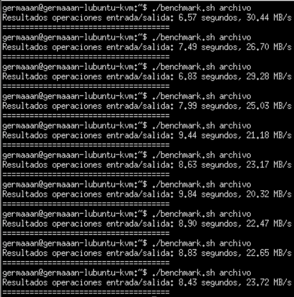

# Ejercicios 3:
### Crear un benchmark de velocidad de entrada salida y comprobar la diferencia entre usar paravirtualización y arrancar la máquina virtual simplemente con `qemu-system-x86_64 -hda /media/Backup/Isos/discovirtual.img`

Para medir la velocidad de entrada salida voy a usar un scrip parecido al que usé en el ejercicio 4 del tema 4. El código del script sería:

```
#!/bin/bash

TIMEFORMAT='%2R'

if [ $# -lt 1 ]; then
    echo -e "\nError: número de argumentos inválido. Uso: $0 archivo\n"
    exit 1
fi

time1+=$( { time `cp $1 $1_2`; } 2>&1 )
vel1=$( bc <<<"scale=2; 200/$time1" )

echo -e "\nResultados operaciones entrada/salida: $time1 segundos, $vel1 MB/s"
echo -e "=====================================\n"
```

También creamos 1 archivo de 200MB que será el que usemos:

```
dd if=/dev/urandom of=archivo bs=191 count=1048576
```

Primero arrancamos la máquina sin usar paravirtualización de la entrada/salida, ejecutamos 10 veces nuestro script sobre el archivo que acabamos de crear:



Arrancamos la máquina ahora con la paravirtualización y seguimos el mismo procedimiento:



Vamos a introducir los datos obtenidos en la siguiente tabla:

|          | Sin "virtio" | Con "virtio" |   Sin "virtio"   |   Con "virtio"   |
|:--------:|:------------:|:------------:|:----------------:|:----------------:|
|          |  Tiempo (s)  |  Tiempo (s)  | Velocidad (MB/s) | Velocidad (MB/s) |
|    #1    |     9'80     |     6'57     |       20'40      |       30'44      |
|    #2    |     9'57     |     7'49     |       20'89      |       26'70      |
|    #3    |     9'26     |     6'83     |       21'59      |       29'28      |
|    #4    |     8'34     |     7'99     |       23'98      |       25'03      |
|    #5    |     7'70     |     9'44     |       25'97      |       21'18      |
|    #6    |     7'63     |     8'63     |       26'21      |       23'17      |
|    #7    |     8'72     |     9'84     |       22'93      |       20'32      |
|    #8    |     7'61     |     8'90     |       26'28      |       22'47      |
|    #9    |     7'58     |     8'83     |       26'38      |       22'65      |
|    #10   |     10'24    |     8'43     |       19'53      |       23'72      |
|          |              |              |                  |                  |
| PROMEDIO |     8'645    |     8'295    |      23'416      |      24'496      |

Como vemos si se ve una mejora, aunque bastante pequeña (de entorno al 4%). Es posible que esta diferencia de rendimiento aumentara en función de un uso más intenso y de unos tamaños de datos mayores.
