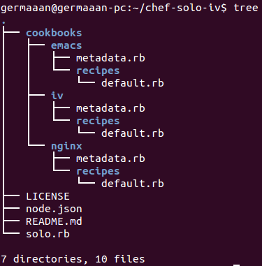
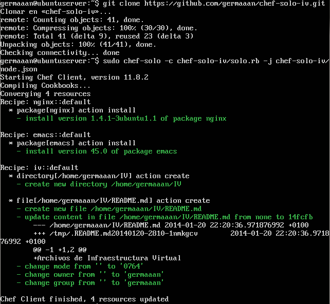

# Ejercicios 2:
### Crear una receta para instalar nginx, tu editor favorito y algún directorio y fichero que uses de forma habitual.

Voy a crear un recetario que contenga una receta para instalar el servidor web **nginx**, otra receta para instalar el editor **emacs** y otra receta que cree un directorio en el que podriamos almacenar los archivos de Infraestructura Virtual con el típico archivo README.md en su interior. Antes de crear el recetario, hay que tener claro los archivos a incluir y la función de cada uno; todos los archivos que voy a crear se muestran en el siguiente árbol de contenido.



El archivos **"solo.rb"** es el archivo de configuración de nuestro recetario; como mínimo debe incluir **"cookbook_path 'RUTA_RECETARIO'"** para indicar en que directorio están situadas nuestras recetas y **"json_attribs 'RUTA_ATRIBUTOS'"** para indicar el archivo JSON con los atributos de cada una de nuestras recetas y la forma de ejecutarlas.

```
cookbook_path File.expand_path("../cookbooks", __FILE__)
json_attribs File.expand_path("../node.json", __FILE__)
```

El archivo **"node.json"** como he indicado antes es el que indicará los atributos de cada una de las recetas de nuestro recetario (nombres, versiones, usuarios...), así como la forma de ejecutarlas (por ejemplo, ejecutar todas las recetas seguidas).

```
{
	"nginx": {
		"version"	: "1.4.1",
		"user"		: "www-data",
		"port"		: "80"
  },

	"emacs": {
		"version"	: "23.4.1"
	},

	"iv": {
		"name"		: "Infraestructura Virtual"
	},

	"run_list":	[
		"recipe[nginx]",
		"recipe[emacs]",
		"recipe[iv]"
	]
}
```

El directorio **"codebooks"** será el que contendrá cada una de las recetas, cada una de las carpetas en su interior representa una receta, y a su vez, en el interior de las carpetas de las recetas nos encontraremos un archivo **"metadata.rb"** con los metadatos sobre la receta y una carpeta **"recipes"** con un archivo **"default.rb"** en su interior, este archivo es la receta en si misma ya que contendrá los "pasos" para realizar dicha receta. En el caso de la receta para crear el directorio, su archivo de metadatos es:

```
maintainer       "German Martinez Maldonado"
maintainer_email "germaaan@gmail.com"
description      "Crea un directorio para los archivos de Infraestructura Virtual"
version          "1.0.0"

recipe "iv", "Receta de creación del directorio de Infraestructura Virtual."
```

Y su receta es: 

```
directory '/home/germaaan/IV'
file "/home/germaaan/IV/README.md" do
  owner "germaaan"
  group "germaaan"
  mode 00764
  action :create
  content "Archivos de Infraestructura Virtual"
end
```

Esta receta creará el directorio **"/home/germaaan/IV"** y en su interior el archivo **"README.md"**, dándole la propiedad al usuario **"germaaan"**, asignándole ese mismo grupo y permisos de lectura, escritura y ejecución para su dueño, solo lectura y escritura para los miembros del mismo grupo, y finalmente, solo permisos de lectura para el resto de usuarios.

En el caso de las recetas para instalar un paquete su contenido es mucho más simple, simplemente deberemos escribir la línea **"package 'PAQUETE'"** para instalar el paquete indicado.

* Archivo **default.rb** para instalar **nginx**:

```
package 'nginx'
```

* Archivo **default.rb** para instalar **emacs**:

```
package 'emacs'
```

Para poder usar fácilmente este recetario desde cualquier ordenador, voy a crear [este repositorio](https://github.com/germaaan/chef-solo-iv) con los archivos del recetario, así simplemente clonando el repositorio y ejecutando el archivo **"solo.rb"** con **chef-solo** podremos usar las recetas que acabo de crear.

```
git clone https://github.com/germaaan/chef-solo-iv.git
sudo chef-solo -c chef-solo-iv/solo.rb -j chef-solo-iv/node.json
```



Ahora solo nos queda comprobar que ciertamente se han realizado correctamente todas las recetas.

```
nginx -v
emacs --version
ls IV/
```


