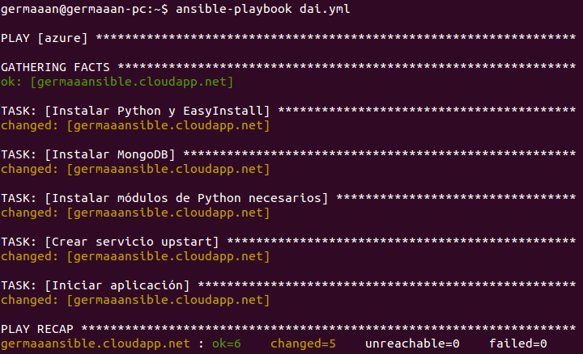

# Ejercicios 5:
### Desplegar la aplicación de DAI con todos los módulos necesarios usando un playbook de Ansible.

Una vez que ya tenemos los fuentes de la aplicación en nuestro servidor, lo único que resta es desplegar dicha aplicación, para ello usaremos un playbook de Ansible. La aplicación está en realizada en Python y usa diversos módulos, por lo que antes de ejecutar la aplicación deberemos instalar el propio **Python** y el paquete **EasyInstall** para instalar los módulos (no he instalado **pip** porque daba errores en la ejecución). Además, como base de datos instalaremos **MongoDB**.

Para la ejecución de la aplicación durante el despliegue, la opción más fácil es convertir nuestra aplicación en un servicio Upstart que podamos manejar mediante `service` para iniciar, parar o reiniciar. Para esto tendremos que crear un script upstart que contenga como iniciar el programa, mediante `template` indicar con `src` la ruta del script en la máquina local y con `dest` indicar la ruta en donde se copiará el script en la máquina aprovisionada (para que podamos usarlo como servicio upstart, el script tiene que estar en la carpeta **/etc/init**). Finalmente con `service` indicamos que la aplicación tiene que estar en ejecución, así que señalamos que tiene que tener `state=running`.

* **Playbook "dai.yml"**

```
---
- hosts: azure
  sudo: yes
  remote_user: germaaan
  tasks:
    - name: Instalar Python y EasyInstall
      apt: name=build-essential state=present
      apt: name=python-dev state=present
      apt: name=python-setuptools state=present
    - name: Instalar MongoDB
      apt: name=mongodb-server state=present
    - name: Instalar módulos de Python necesarios
      command: easy_install web.py mako pymongo feedparser tweepy geopy
    - name: Crear servicio upstart
      template: src=dai.conf dest=/etc/init/dai.conf owner=root group=root mode=0644
    - name: Iniciar aplicación
      service: name=dai state=running
```

El script upstart simplemente ubica la ejecución en el directorio en el que se encuentra la aplicación (**/home/germaaan/dai_practica_4**) y la ejecuta para un acceso externo (por eso la IP **0.0.0.0**) y un puerto **8000**.

* **Script upstart "dai.conf"**

```
script
    cd /home/germaaan/dai_practica_4
    python practica_4.py 0.0.0.0:8000
end script
```

Solo queda ordenar el aprovisionamiento mediante `ansible-playbook`.

```
ansible-playbook dai.yml
```



Para que la aplicación pueda ser accesible, tenemos que añadir extremos a la máquina virtual, así que añadimos un extremo que usando el protocolo TCP reenvie la información del puerto 8000 privado (en el que está funcionando nuestra aplicación) al puerto público 80 (al que se podrá conectar cualquier navegador).

```
azure vm endpoint create -n http germaaansible 80 8000
azure vm endpoint list germaaansible
```


Ahora si accedemos a [http://germaaansible.cloudapp.net/](http://germaaansible.cloudapp.net/) veremos la aplicación funcionando. Si no queremos registrarnos podemos usar el usuario **"prueba"** y contraseña **"pruebaprueba"**.


